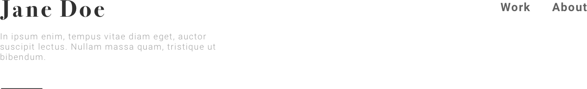
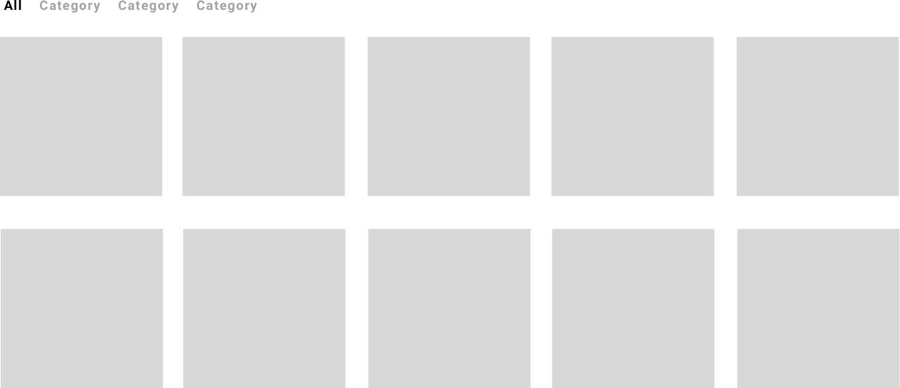
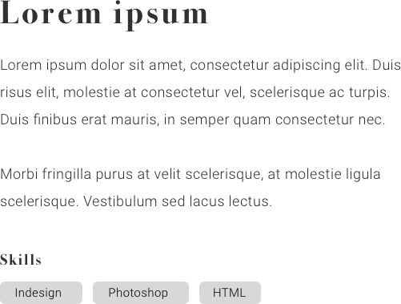

## Assignment 3 - Templates
Look at the wireframe sketches explains the website's different views, and how content is layed out on them.

[Wireframe sketches](documents/portfolio-theme-wireframes.pdf)

### Bulding blocks
A good start is to define and create the common parts of the template. By doing so we can build all templates we need effectively and without repeating any code. Wordpress' template parts is perfect for this. It's important to use general naming describing the parts' appearence and behavior, instead of the exact context we might use them for now.

#### Header navigation (partials/navhead.php)

A common area used in all views with the logo, description and menu.

* **Logo** - Should be linked to the website's *home url* and show the *site title*.
* **Text widget** - Containing a short description of the website.
* **Menu** - Should be showing a specific *custom menu*.

#### Postgrid (partials/postgrid.php)

A collection of posts listed in a grid with a taxonomy filter.

* **Filter** - Listing a taxonomy's terms to filter the grid items with querystring parameters.
* **Post list** - Looping all posts within a specific post type and the current querystring value.

#### Text content (partials/content.php)

Presenting the content from a single post with image, title and content.

* **Featured image** - Current post's or page's featured image
* **Title** - The current post's title.
* **Content** - The current post's content.

> Tip: Use a conditional statement to check if the template part us beeing used with a single project or not. Can be useful when listing different collection of the taxonomy terms.

### Result
Create a minimum amount of templates using the template parts above, to match the content plan and wireframes. Each template should begin with `get_header()` and end with `get_footer()`;

**Push your theme to the remote repository.**

> Tip: If you need help, use Google or Wordpress official Codex: https://codex.wordpress.org/. If stuck please visit the Slack channel and ask for help.
